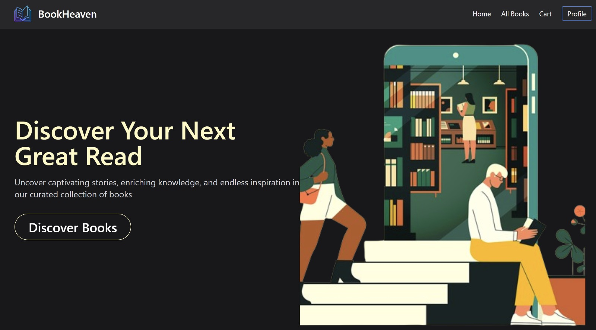
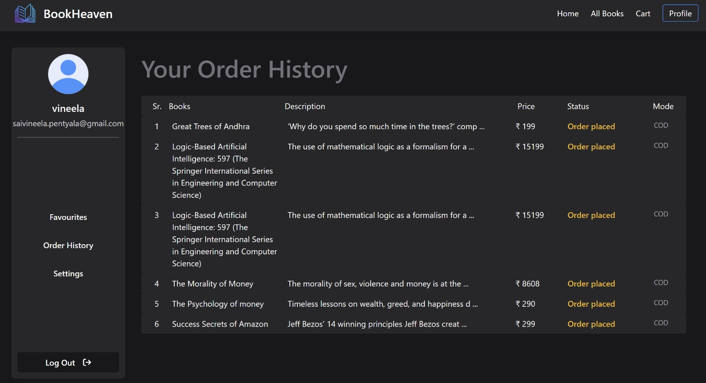
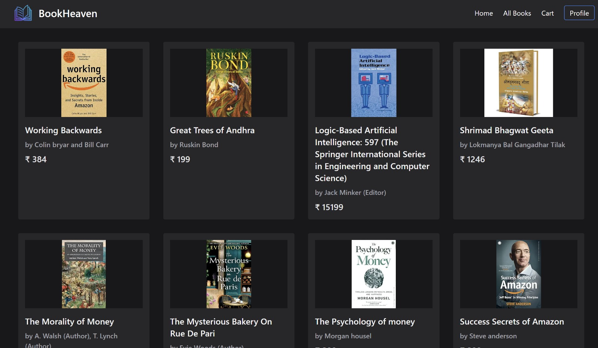
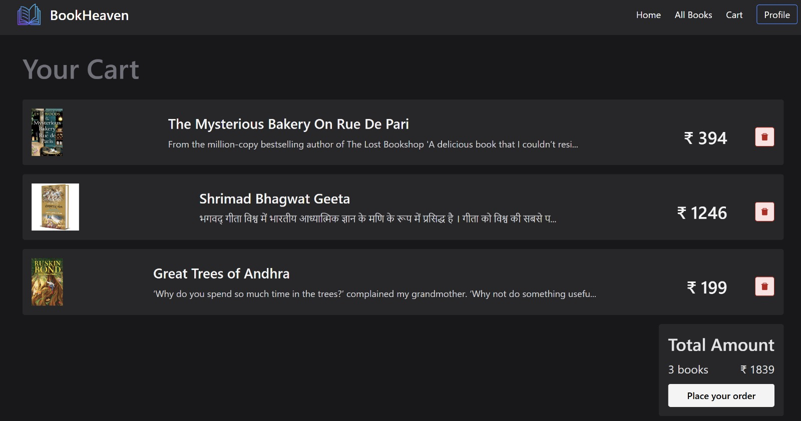
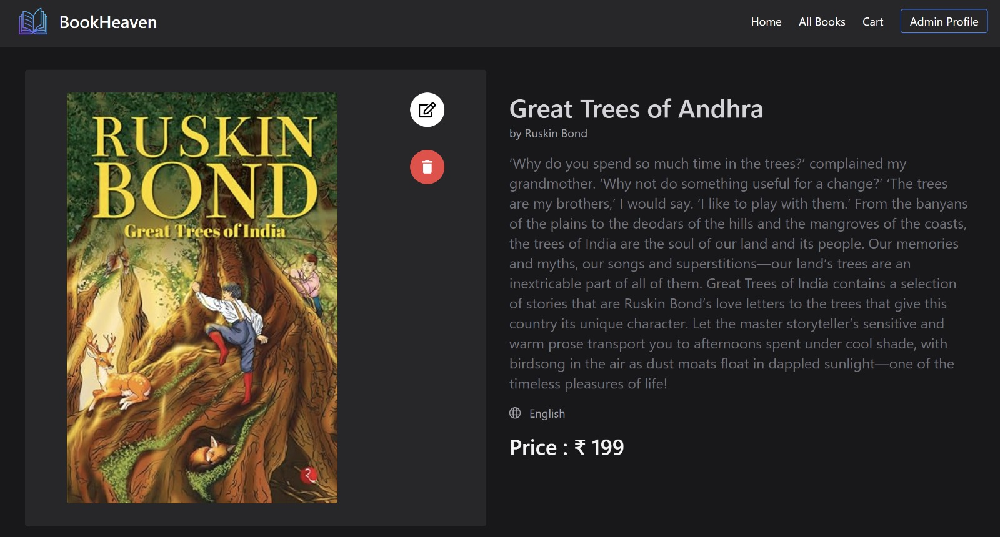
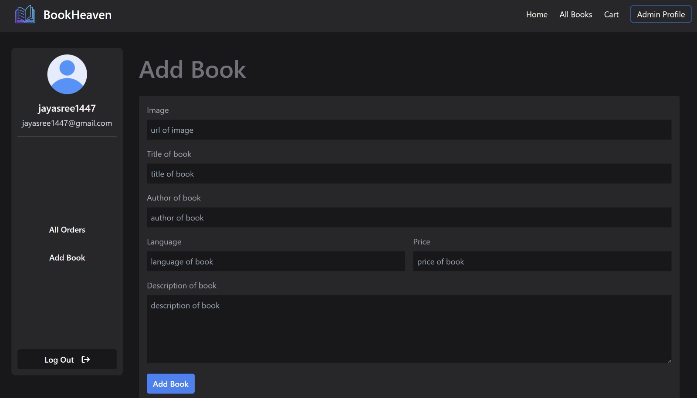

# 📚 MERN Stack E-Book Store Application

This is a full-featured E-Book Store web application built using the **MERN Stack** (MongoDB, Express.js, React.js, Node.js). It includes separate dashboards for **Admin** and **Users**, allowing complete control over book listings, orders, and customer interaction.

---

## 🌟 Features

### 🔐 Admin Dashboard:
- Add, edit, or delete books from the store.
- View and manage all orders placed.
- Access full customer order details including shipping addresses.

### 👤 User Dashboard:
- Browse available books with full descriptions.
- Mark books as **favorites** for easy access later.
- Add books to cart and place orders.
- View order history.

---

## 🖼️ Screenshots

### 1. Home Page


### 2. User Dashboard


### 3. Book Details Page


### 4. Add to Cart


### 5. Admin Dashboard


### 6. Add Book Page


### 7. Orders Page (Admin View)
.jpg)

---

## 🛠️ How to Run the Project

Make sure you have **Node.js**, **npm**, and **MongoDB** installed on your system.

### 1️⃣ Clone the Repository
```bash
git clone https://github.com/your-username/ebook-store.git

2️⃣ Start the Backend (Server)
Navigate to the backend directory, install the dependencies, and start the server:
cd backend
npm install
node app.js
After running the backend, you should see the following message indicating that the database is connected and the server is running:

DB Connected
Server running on port 5000

3️⃣ Start the Frontend (React App)
In a new terminal window, navigate to the frontend directory, install the dependencies, and start the React app:

cd frontend
npm install
npm run dev

🚀 Now your application should be fully up and running!